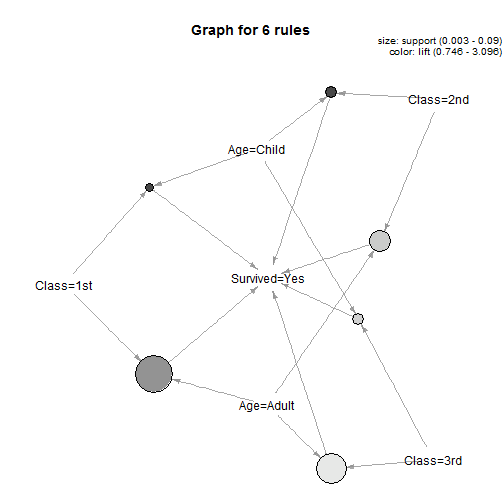

Association Rules
========================================================
## Basics of Association Rules
support$(A \Rightarrow B)$=$P(A \cup B)$

confidence$(A \Rightarrow B)$=$P(A | B)$

lift$(A \Rightarrow B)$=confidence$(A \Rightarrow B)$/$P(B)$
##  The Titanic Dataset
The `Titanic` dataset in the *datasets* package is a 4-dimensional table with summarized information
on the fate of passengers on the Titanic according to social class, sex, age and survival.


```r
str(Titanic)
```

```
##  table [1:4, 1:2, 1:2, 1:2] 0 0 35 0 0 0 17 0 118 154 ...
##  - attr(*, "dimnames")=List of 4
##   ..$ Class   : chr [1:4] "1st" "2nd" "3rd" "Crew"
##   ..$ Sex     : chr [1:2] "Male" "Female"
##   ..$ Age     : chr [1:2] "Child" "Adult"
##   ..$ Survived: chr [1:2] "No" "Yes"
```

```r
(df <- as.data.frame(Titanic))
```

```
##    Class    Sex   Age Survived Freq
## 1    1st   Male Child       No    0
## 2    2nd   Male Child       No    0
## 3    3rd   Male Child       No   35
## 4   Crew   Male Child       No    0
## 5    1st Female Child       No    0
## 6    2nd Female Child       No    0
## 7    3rd Female Child       No   17
## 8   Crew Female Child       No    0
## 9    1st   Male Adult       No  118
## 10   2nd   Male Adult       No  154
## 11   3rd   Male Adult       No  387
## 12  Crew   Male Adult       No  670
## 13   1st Female Adult       No    4
## 14   2nd Female Adult       No   13
## 15   3rd Female Adult       No   89
## 16  Crew Female Adult       No    3
## 17   1st   Male Child      Yes    5
## 18   2nd   Male Child      Yes   11
## 19   3rd   Male Child      Yes   13
## 20  Crew   Male Child      Yes    0
## 21   1st Female Child      Yes    1
## 22   2nd Female Child      Yes   13
## 23   3rd Female Child      Yes   14
## 24  Crew Female Child      Yes    0
## 25   1st   Male Adult      Yes   57
## 26   2nd   Male Adult      Yes   14
## 27   3rd   Male Adult      Yes   75
## 28  Crew   Male Adult      Yes  192
## 29   1st Female Adult      Yes  140
## 30   2nd Female Adult      Yes   80
## 31   3rd Female Adult      Yes   76
## 32  Crew Female Adult      Yes   20
```

* 第1列表示 1st class 中的男性孩童死了0人 and so on.
* 第17列表示 1st class 中的男性孩童存活5人 and so on.

We reconstruct the raw data as `titanic.raw`, where **each row
represents a person**. 


```r
titanic.raw <- NULL
for(i in 1:4) {
titanic.raw <- cbind(titanic.raw, rep(as.character(df[,i]), df$Freq))
}
titanic.raw <- as.data.frame(titanic.raw)
names(titanic.raw) <- names(df)[1:4]
str(titanic.raw)
```

```
## 'data.frame':	2201 obs. of  4 variables:
##  $ Class   : Factor w/ 4 levels "1st","2nd","3rd",..: 3 3 3 3 3 3 3 3 3 3 ...
##  $ Sex     : Factor w/ 2 levels "Female","Male": 2 2 2 2 2 2 2 2 2 2 ...
##  $ Age     : Factor w/ 2 levels "Adult","Child": 2 2 2 2 2 2 2 2 2 2 ...
##  $ Survived: Factor w/ 2 levels "No","Yes": 1 1 1 1 1 1 1 1 1 1 ...
```

```r
head(titanic.raw)
```

```
##   Class  Sex   Age Survived
## 1   3rd Male Child       No
## 2   3rd Male Child       No
## 3   3rd Male Child       No
## 4   3rd Male Child       No
## 5   3rd Male Child       No
## 6   3rd Male Child       No
```

```r
summary(titanic.raw)
```

```
##   Class         Sex          Age       Survived  
##  1st :325   Female: 470   Adult:2092   No :1490  
##  2nd :285   Male  :1731   Child: 109   Yes: 711  
##  3rd :706                                        
##  Crew:885
```

## Association Rule Mining

```r
library(arules)
rules.all <- apriori(titanic.raw,
                     control=list(verbose=FALSE), ## 不要 show 過程
                     parameter = list(minlen=2 , supp=0.005, conf=0.8), ##(the minimal number of items per item set ,  the minimal surpport, the minimal confidence)
                     appearance = list(rhs=c("Survived=No", "Survived=Yes"),
                                       default="lhs")) ## (set item for right hand side, the default appearance for all items not explicitly mentioned in the other elements of the list.)
quality(rules.all) <- round(quality(rules.all), digits=3)
rules.sorted <- sort(rules.all, by="lift")
inspect(rules.sorted)
```

```
##    lhs             rhs            support confidence  lift
## 1  {Class=2nd,                                            
##     Age=Child}  => {Survived=Yes}   0.011      1.000 3.096
## 2  {Class=2nd,                                            
##     Sex=Female,                                           
##     Age=Child}  => {Survived=Yes}   0.006      1.000 3.096
## 3  {Class=1st,                                            
##     Sex=Female} => {Survived=Yes}   0.064      0.972 3.010
## 4  {Class=1st,                                            
##     Sex=Female,                                           
##     Age=Adult}  => {Survived=Yes}   0.064      0.972 3.010
## 5  {Class=2nd,                                            
##     Sex=Female} => {Survived=Yes}   0.042      0.877 2.716
## 6  {Class=Crew,                                           
##     Sex=Female} => {Survived=Yes}   0.009      0.870 2.692
## 7  {Class=Crew,                                           
##     Sex=Female,                                           
##     Age=Adult}  => {Survived=Yes}   0.009      0.870 2.692
## 8  {Class=2nd,                                            
##     Sex=Female,                                           
##     Age=Adult}  => {Survived=Yes}   0.036      0.860 2.663
## 9  {Class=2nd,                                            
##     Sex=Male,                                             
##     Age=Adult}  => {Survived=No}    0.070      0.917 1.354
## 10 {Class=2nd,                                            
##     Sex=Male}   => {Survived=No}    0.070      0.860 1.271
## 11 {Class=3rd,                                            
##     Sex=Male,                                             
##     Age=Adult}  => {Survived=No}    0.176      0.838 1.237
## 12 {Class=3rd,                                            
##     Sex=Male}   => {Survived=No}    0.192      0.827 1.222
```

## Removing Redundancy

在有了 rule 1 之後, rule 2 並不能提供更多訊息, we call rule 2 is a super rule of rule 1.
The following code find and delete all super rule.


```r
subset.matrix <- is.subset(rules.sorted, rules.sorted)
redundant <- colSums(subset.matrix, na.rm=T) > 1
which(redundant)
```

```
## [1]  2  4  7  8  9 11
```

```r
rules.pruned <- rules.sorted[!redundant]
inspect(rules.pruned)
```

```
##   lhs             rhs            support confidence  lift
## 1 {Class=2nd,                                            
##    Age=Child}  => {Survived=Yes}   0.011      1.000 3.096
## 2 {Class=1st,                                            
##    Sex=Female} => {Survived=Yes}   0.064      0.972 3.010
## 3 {Class=2nd,                                            
##    Sex=Female} => {Survived=Yes}   0.042      0.877 2.716
## 4 {Class=Crew,                                           
##    Sex=Female} => {Survived=Yes}   0.009      0.870 2.692
## 5 {Class=2nd,                                            
##    Sex=Male}   => {Survived=No}    0.070      0.860 1.271
## 6 {Class=3rd,                                            
##    Sex=Male}   => {Survived=No}    0.192      0.827 1.222
```

## Interpreting Rules

只想知道 `Class` 與 `Age` 與 `survived=Yes`
的關係

```r
rules <- apriori(titanic.raw,
parameter = list(minlen=3, supp=0.002, conf=0.2),
appearance = list(rhs=c("Survived=Yes"),
lhs=c("Class=1st", "Class=2nd", "Class=3rd",
"Age=Child", "Age=Adult"),
default="none"),
control = list(verbose=F))
rules.sorted <- sort(rules, by="confidence")
inspect(rules.sorted)
```

```
##   lhs            rhs             support confidence   lift
## 1 {Class=2nd,                                             
##    Age=Child} => {Survived=Yes} 0.010904     1.0000 3.0956
## 2 {Class=1st,                                             
##    Age=Child} => {Survived=Yes} 0.002726     1.0000 3.0956
## 3 {Class=1st,                                             
##    Age=Adult} => {Survived=Yes} 0.089505     0.6176 1.9117
## 4 {Class=2nd,                                             
##    Age=Adult} => {Survived=Yes} 0.042708     0.3602 1.1149
## 5 {Class=3rd,                                             
##    Age=Child} => {Survived=Yes} 0.012267     0.3418 1.0580
## 6 {Class=3rd,                                             
##    Age=Adult} => {Survived=Yes} 0.068605     0.2408 0.7455
```

* High survival rate for child in 1st class and 2nd class, but not in 3rd class
* 3rd class has lowest survival rate no matter child or adult.  

## Visualizing Association Rules

```r
library(arulesViz)
plot(rules, method="graph", control=list(type="items"))
```

 
